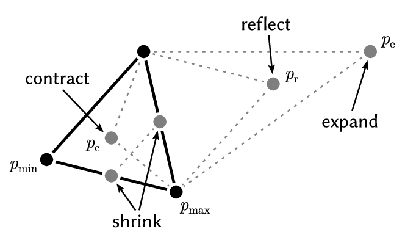

# Optimization Algorithms

## Nelder-Mead

Nelder-Mead is considered a *direct* search method (based on function comparison) and is often applied to nonlinear optimization problems for which derivatives may not be known.

It's primary method is creating a simplex using a number of parameter values, evaluating each of them, and then adjusting the topology of the simplex depending on the evaluations.

It consists of a number of operations:

- Shrink
- Contract
- Reflect
- Expand

## Gradient Descent

Gradient Descent is considered a 'gradient-based' optimization method. Using a gradient, it will traverse in the direction that the gradient is most negative for minimisation (or most positive for maximisation) problems.

The function must be *defined* and *differentiable*. 

The general formula is:

$x_{t+1} = x_t + \alpha \nabla f(x_t),$

Where:
- $\nabla f(x_t)$ is the gradient of $f$ evaluated with variables $x_t$
- $\alpha$ is the *learning rate*

## L-BFGS-B (Limited-memory Broyden Fletcher Golfarb Shanno)

[Useful Reference](https://medium.com/gaussian-machine/implement-l-bfgs-optimization-from-scratch-3e5c909f9079)

A gradient-based, *Quasi Newton* method.

A *Newton* is defined as an optimization method that uses a *Hessian Matrix* (second derivative matrix) during it's update step. *Quasi Newton* implies that the full Hessian Matrix isn't used, but rather an approximation, due to the computational complexity of calculating and inverting the Hessian Matrix.

Derivatives $f'(x)$ of the function $f(x)$ are used to find the direction of steepest descent, and to form an estimate of the Hessian matrix $f''(x)$.

Newton's method is defined as:

$x_{t+1} = x_t + H_t^{-1} \alpha \nabla f(x_t),$

Where:
- $\nabla f(x_t)$ is the gradient of $f$ evaluated with variables $x_t$
- $H_t$ is *Hessian Matrix* (second derivative matrix) at time $t$.

Computing the Hessian matrix is very computationally expensive for large problems, so we instead *approximate* the Hessian matrix using only few recent gradients and position changes. *Two-loop recursion* does this efficiently.

Line search utilizes *Wolfe's conditions*.